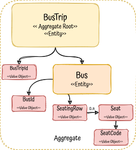
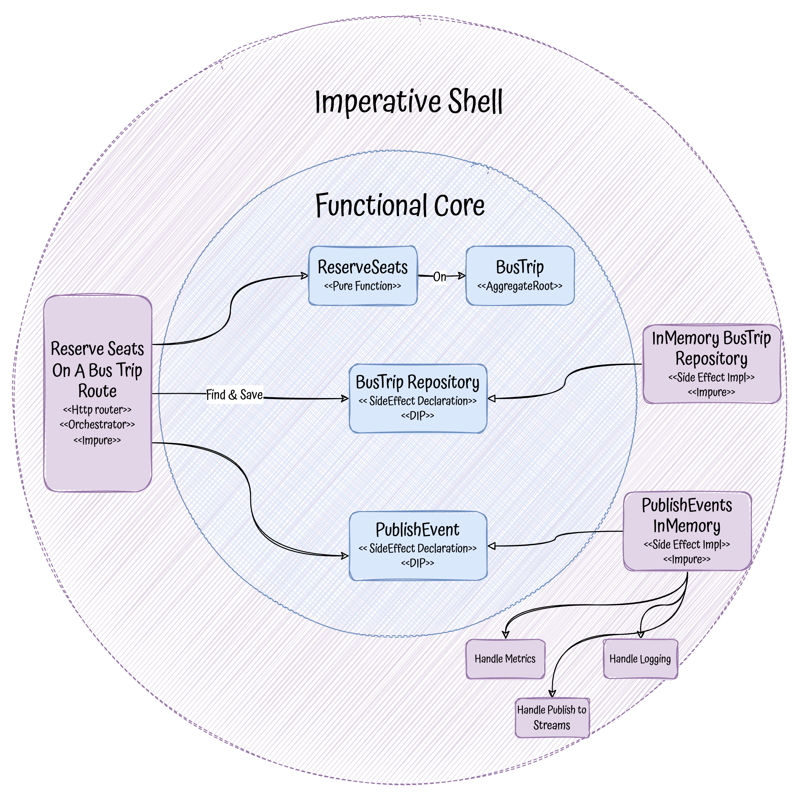
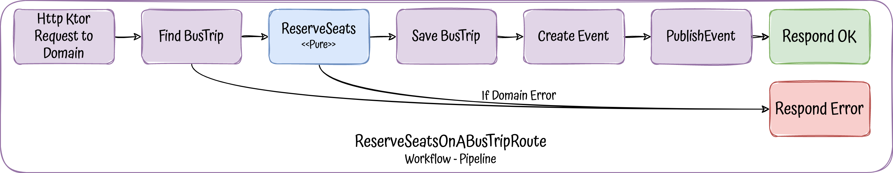
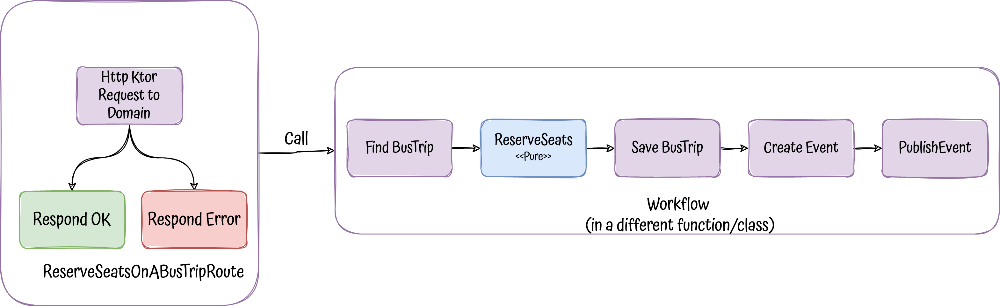

# Functional-core, Imperative-shell - A different architectural style

## Description

Nowadays almost all the projects with Domain-Driven Design are leveraging on architectures like layered or hexagonal, the last
one the preferred one by DDD community.

But, is there any other architectural style that we can apply instead?

Yes, let's explore **FC-IS** (Functional-core, Imperative-shell), a different way to architect and structure our DDD applications 
together with FP (Functional Programming), in this case a microservice.


Keywords: `DDD`, `microservice`, `kotlin`, `Functional-core, Imperative-Shell`, `SOLID`, `Domain-Driven Design`, `functional-programming`,
`Testing`, `Domain-Events`

## The problem to solve

To drive all the project, we need a problem to solve, in this case it will be a single use-case `bus seat reservation`.

- Http API
- Single endpoint to reserve seats on a bus trip

## DDD model

<p align="center">
  
</p>

## Functional-core, Imperative-shell architecture

The baseline of this architectural style is pretty simple, it is based in the premise to split all the code in two:

<p align="center">
  
</p>

1. [**PURE**](https://en.wikipedia.org/wiki/Pure_function), no [side effects](https://en.wikipedia.org/wiki/Side_effect_(computer_science))
2. **IMPURE**, with side effects

Besides this split, it is based in some principles, all coming from functional programming:

1. All the domain logic should be in the **Functional Core**, it will use immutable data structures and pure functions.
2. All infrastructure code lives in the edge of your app, the **Imperative Shell**, it will perform any side effects, and it could
be mutable.
3. Dependencies go inward, Imperative Shell can call the Functional Core but not the other way around.

**NOTE:** A function is said to have side effects when it depends on or modifies a state outside its scope, such as variable passed by reference,
global variable, logging to console, doing database operations ...e

### Roles

Functional Core:
- Aggregates, Entities or Value Objects will live here, all of them, of course, immutable
- Any domain logic, in the form of pure functions
- Side effects declarations (not implementations), we don't want side effects, but we want to make them visible. They will be just types, 
 abstractions or interfaces ...

Imperative Shell:
- Orchestration and implementation of any side effect, including any external dependencies such as persistence, queues, 
  http clients, metrics, logs ...
- Chassis frameworks, such as Spring, ktor, quarkus and libs, like transactionality, de/serialization to different formats
- Direct dependency to the Core (Domain)
- It shouldn't contain any domain logic such as business rules, validations or conditional branching (if-else) ...

### Architecture overview

<p align="center">
  
</p>

### Workflows

This architecture relies heavily on functional programming concepts like [either monad](https://github.com/albertllousas/monads-explained#monads-explained-in-kotlin) and [railway-programming](https://fsharpforfunandprofit.com/rop/), without them,
it would be really difficult to implement.

<p align="center">
  
</p>

**Note**: We are only dealing with domain errors, for any other unexpected exception we will let the system crash and deal
with it at ktor level (ktor framework interceptor).

All the steps in the workflow/pipeline are implemented in the ktor http [router function](./src/main/kotlin/com/bus/shell/entrypoints/http/ReserveSeatsOnABusTripRoute.kt) itself, **putting all side effects together**,
accumulating them **in the boundary of the app**. **Someone could say** that this is **damaging a good separation of concerns**,
since we are putting all the workflow together with the http handling, but worse case scenario, 
**we can separate part of the workflow in a separate function if needed**, in the shell (never in the core).

<p align="center">
  
</p>

Separating workflows in a separate functions or classes, the architecture is similar to [hexagonal](https://github.com/albertllousas/implementing-hexagonal-architecture) in terms
of layers, changing of course, packages and structure.

It **would be preferable** to have all the workflow in the **same function/file/class** (as the first diagram of this section shows), why?
- Skip multiple application layers
- Keep the shell as thin as possible 
- Promote cohesion
- Having one level of orchestration

### Code Structure
```shell
.
└── com
    └── bus
        ├── core
        │   ├── Bus.kt
        │   ├── Errors.kt
        │   ├── Events.kt
        │   └── SideEffects.kt
        └── shell
            ├── KtorApp.kt
            ├── db
            │   └── InMemoryBusTripRepository.kt
            ├── entrypoints
            │   └── http
            │       └── ReserveSeatsOnABusTripRoute.kt
            └── pubsub
                ├── HandleLogging.kt
                └── InMemoryPublisher.kt

```

# Resources

- https://github.com/42skillz/livecoding-beyond-hexagonal-architecture
- https://github.com/kbilsted/Functional-core-imperative-shell/blob/master/README.md