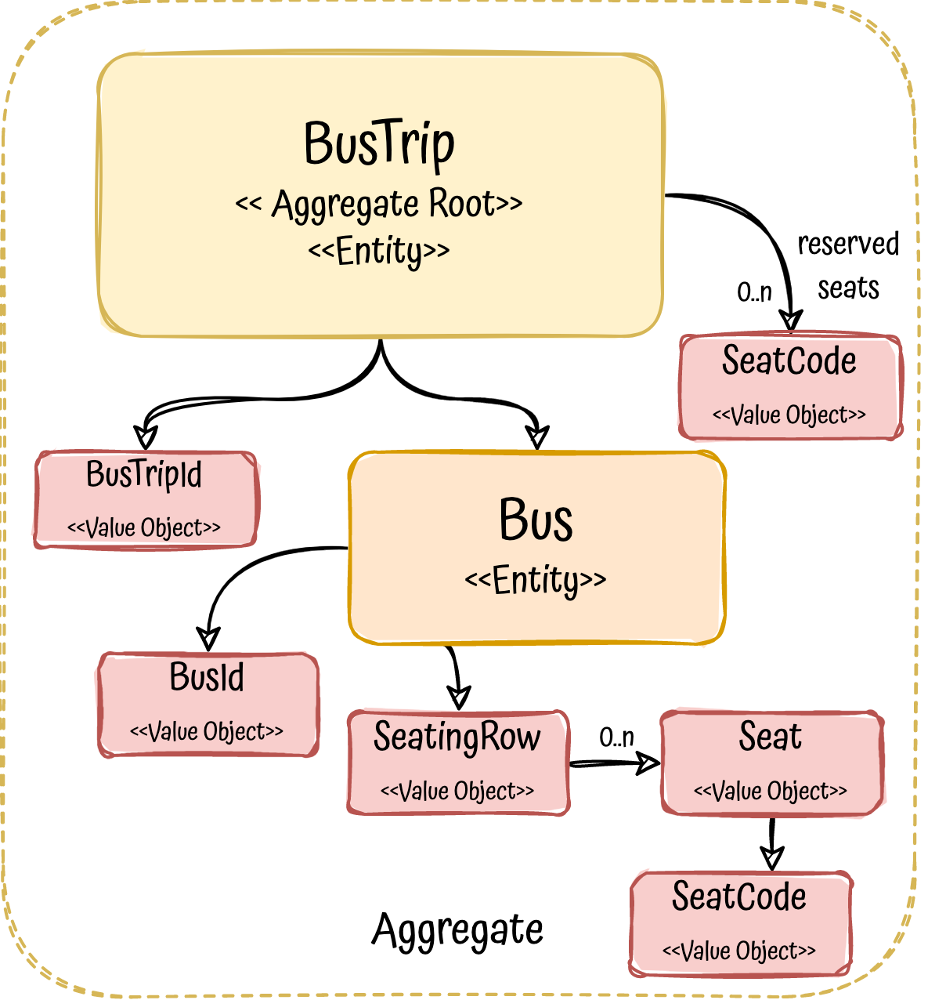
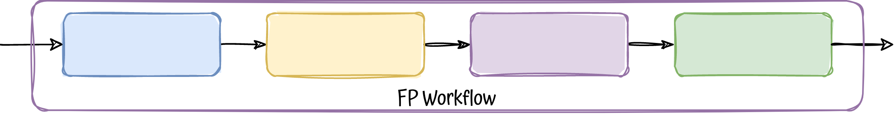

# Functional-core, Imperative-shell - A different architectural style

## Description

Nowadays almost any Domain-Driven Design project is based on architectures like layered or [hexagonal](https://github.com/albertllousas/implementing-hexagonal-architecture), being the last
one the preferred one by DDD community.

But, is there any other architectural style that we can apply instead?

Yes, let's explore **FC-IS** (Functional-core, Imperative-shell), a different way to architect and structure our DDD applications 
together with FP (Functional Programming).


Keywords: `DDD`, `microservice`, `kotlin`, `Functional-core, Imperative-Shell`, `SOLID`, `Domain-Driven Design`, `functional-programming`,
`Testing`, `Domain-Events`

## The problem to solve

To drive all the project, we need a problem to solve, in this case it will be a single use-case `a bus seat reservation` 
which will be a single http endpoint to reserve seats on a bus trip.

## DDD model

<p align="center">
  
</p>

## Functional-core, Imperative-shell architecture

The baseline of this architectural style is pretty simple, it is based on the premise to split all the code in two:

<p align="center">
  
</p>

1. [**PURE**](https://en.wikipedia.org/wiki/Pure_function), no [side effects](https://en.wikipedia.org/wiki/Side_effect_(computer_science)), the functional Core
2. **IMPURE**, with side effects, the Imperative Shell

Besides this split, it is based in some principles, all coming from functional programming:

1. All the domain logic should be in the **Functional Core**, it will use immutable data structures and pure functions.
2. All infrastructure code lives in the edge of your app, the **Imperative Shell**, it will perform any side effects, and it could
be mutable.
3. Dependencies go inward, Imperative Shell can depend on the Functional Core but not the other way around.

**NOTE:** A function is said to have side effects when it depends on, or modifies a state outside its scope, such as variable passed by reference,
global variable, logging to console, perform database operations ...

### Roles

Functional Core:
- Aggregates, Entities or Value Objects will live here, all of them, of course, immutable
- Any domain logic, in the form of pure functions
- Side effects declarations (not implementations), we don't want side effects, but we want to make them visible. They will be just types, 
 abstractions or interfaces ... (similar to ports in hexagonal)

Imperative Shell:
- Implementation of any side effect, including any external dependencies such as persistence, queues, 
  http clients, metrics, logs ...
- Chassis frameworks, such as Spring, ktor, quarkus or libs, like transactionality, de/serialization ...
- Workflows, just the orchestration of infrastructure and domain logic to achieve business usecases.
- It shouldn't contain any domain logic such as business rules, validations or conditional branching (if-else) ...

### Architecture overview

<p align="center">
  
</p>

As you can see, this architecture is compliant with dependency inversion principle, the D of SOLID, higher modules don't
depend on low-level modules, they depend on abstractions, defined in the core (the domain).

### Workflows

In OOP world, in architecture styles such as layered or hexagonal, codes tend to look like a tangled net of requests and responses,
that's because many reasons such as the nature of objects communication, old OO design patterns or by having side effects everywhere, 
with the consequence of data flowing in many directions. 

<p align="center">
  
</p>

Instead, Functional programming builds systems by composing and chaining functions, connecting the output of one to the 
next's input, creating pipelines, this pipelines can be seen as **business workflows** by which the **data flows in only one direction**, 
removing the sense of layers.  

<p align="center">
  
</p>

This workflow oriented architecture relies heavily on functional programming concepts like [either monad](https://github.com/albertllousas/monads-explained#monads-explained-in-kotlin) or [railway-programming](https://fsharpforfunandprofit.com/rop/), without them,
it would be really difficult to implement.

<p align="center">
  
</p>


All the steps in the workflow are implemented in the ktor http [router function](./src/main/kotlin/com/bus/shell/entrypoints/http/ReserveSeatsOnABusTripRoute.kt) itself, **putting all side effects together**,
pushing them **to the boundary of the app**. **Someone could say** that we are **not promoting a good separation of concerns**,
since we are putting all the workflow together with the http concerns; if this is really an issue, **we could separate part of 
the workflow in a separate function if needed**, in the shell (never in the core).

<p align="center">
  
</p>

Putting workflows in a separate functions or classes, the architecture could be similar to [hexagonal](https://github.com/albertllousas/implementing-hexagonal-architecture) in terms
of layers, changing of course, packages and structure.

But it **would be preferable** to have all the workflow in the **same function/file/class** (as the first diagram of this section shows), why?
- Skip multiple application layers
- Keep the shell as thin as possible 
- Promote cohesion
- Having one level of orchestration

### Code Structure
```shell
.
└── com
    └── bus
        ├── core
        │   ├── Bus.kt
        │   ├── Errors.kt
        │   ├── Events.kt
        │   └── SideEffects.kt
        └── shell
            ├── KtorApp.kt
            ├── db
            │   └── InMemoryBusTripRepository.kt
            ├── entrypoints
            │   └── http
            │       └── ReserveSeatsOnABusTripRoute.kt
            └── pubsub
                ├── HandleLogging.kt
                └── InMemoryPublisher.kt

```

# Resources

- https://github.com/42skillz/livecoding-beyond-hexagonal-architecture
- https://increment.com/software-architecture/primer-on-functional-architecture/
- https://github.com/kbilsted/Functional-core-imperative-shell/blob/master/README.md